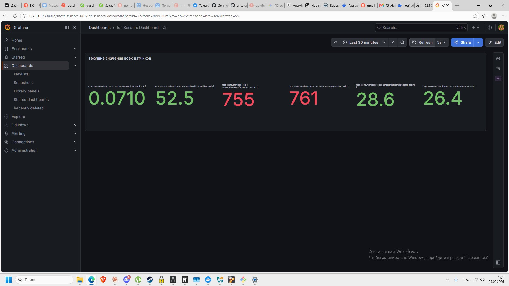

# Отчет по лабораторной работе: Docker и контейнеризация IoT-системы

## Архитектура системы

Система построена на базе трёх виртуальных машин из Лабораторной работы 1 и реализует IoT-мониторинг с помощью Docker-контейнеров.

```
[Linux A / smirnovclient 192.168.10.10]
  └── 6 симуляторов датчиков (Docker)
        └── публикует данные по MQTT →

[Linux B / smirnovgateway 192.168.10.1]
  └── Mosquitto MQTT брокер (Docker, порт 1883)
        └── передаёт данные →

[Linux C / smirnovserver 192.168.15.10]
  └── Telegraf → InfluxDB 1.8 → Grafana (docker-compose, порт 3000)
```

---

## 1. Linux B (smirnovgateway) — MQTT брокер

### Установка Docker и запуск Mosquitto

```bash
sudo apt install -y docker.io
sudo ufw allow 1883/tcp
sudo docker run -d --name broker -p 1883:1883 eclipse-mosquitto
```

### mosquitto.conf

```
listener 1883
allow_anonymous true
```

---

## 2. Linux A (smirnovclient) — Симуляторы датчиков

### Классы датчиков

Реализован базовый класс `Sensor` и 4 наследника с формулами на основе даты рождения (15.10.2002):

| Тип | Класс | Диапазон | Формула |
|-----|-------|----------|---------|
| Температура | `Temperature` | ~15–35 °C | амплитуда = BIRTH_DAY / 3 = **5** |
| Давление | `Pressure` | ~740–780 мм рт.ст. | смещение = BIRTH_MONTH / 10 = **1.0** |
| Ток | `Current` | 0–5 А | масштаб = (BIRTH_YEAR % 100) * 0.005 |
| Влажность | `Humidity` | 30–90 % | шаг = BIRTH_DAY / 15 = **1.0** |

### Переменные среды

| Переменная | Описание | Пример |
|------------|----------|--------|
| `SIM_HOST` | IP брокера | `192.168.10.1` |
| `SIM_NAME` | Имя датчика | `temp_room1` |
| `SIM_PERIOD` | Интервал (сек) | `5` |
| `SIM_TYPE` | Тип датчика | `temperature` |
| `SIM_TOPIC_FORMAT` | Формат: `plain` или `json` | `plain` |

### Сборка и публикация образа

```bash
sudo docker build -t mikesma1/data-simulator .
sudo docker push mikesma1/data-simulator
```

Образ: `docker.io/mikesma1/data-simulator`

### Запуск 6 контейнеров

```bash
sudo docker-compose up -d
```

---

## 3. Linux C (smirnovserver) — Стек мониторинга

```bash
cd ~/infra && sudo docker-compose up -d
```

Запущены контейнеры в сети `server-net`: influxdb, telegraf, grafana.

### Результат — Grafana Dashboard



| Датчик | Значение |
|--------|----------|
| current_line_A | 0.0710 А |
| humidity_main | 52.5 % |
| pressure_backup | 755 мм рт.ст. |
| pressure_main | 761 мм рт.ст. |
| temp_room1 | 28.6 °C |
| temp_room2 | 26.4 °C |

---

## 4. Инструкция по запуску

**Linux B:** `cd vms/gateway/mosquitto && bash run_broker.sh`

**Linux A:** `cd vms/client/simulator && sudo docker-compose up -d`

**Linux C:** `cd vms/server/infra && sudo docker-compose up -d`

Grafana: `http://192.168.15.10:3000` (admin/admin)

Docker Hub: `docker pull mikesma1/data-simulator`
